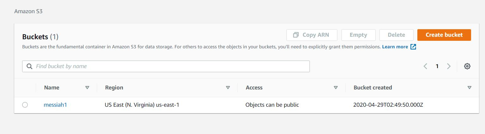
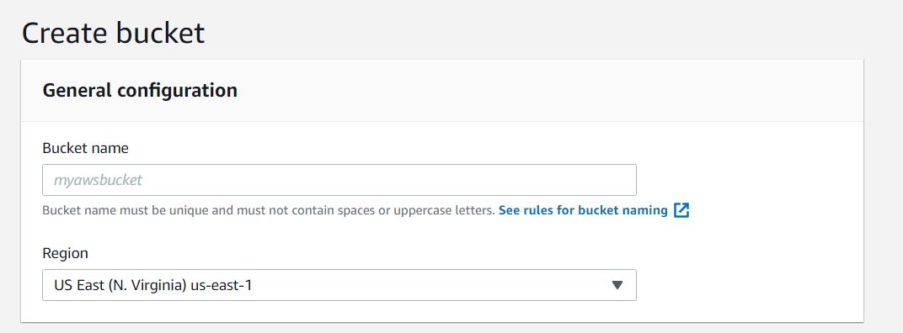
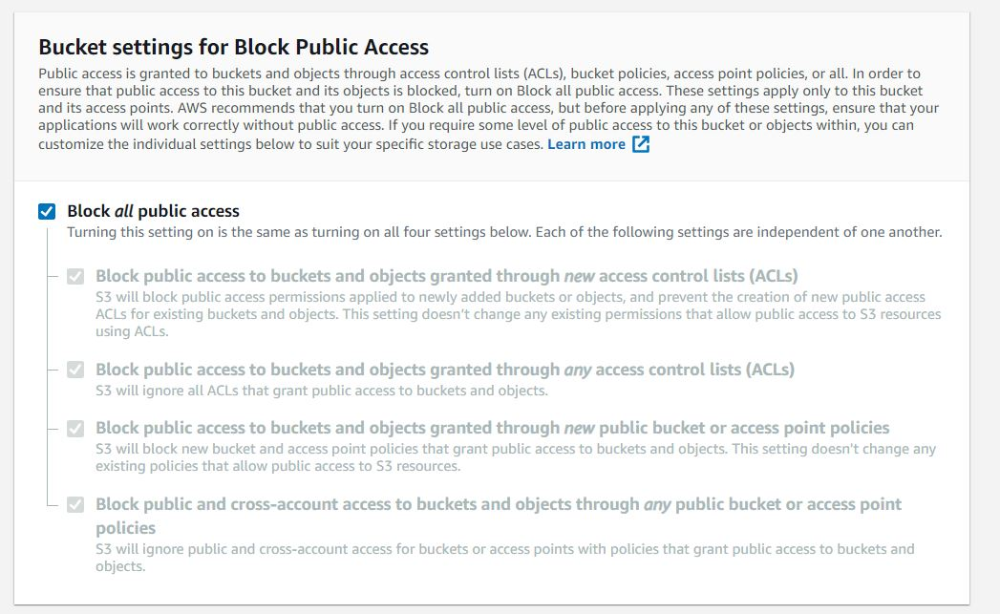

## What is Amazonn S3?
   Amazon S3 is a service in AWS that you can use to store and retrieve any amount of data,at any time, from anywhere on the web.  
   It is designed for large capacity,low cost storage provision across multiple geographical regions.  
   Amazon S3 provides IT companies with **Secure**, **Durable** and **Highly Scalable** object storage.  
   You can store virtually any kind of data, in any format, in S3 and when we talk about capacity, the volume and the number of objects
   that we can store in S3 are unlimited.
   
## How to create bucket in S3 for storage?
   
   1) Search for **S3** in **Services** and then click on **S3**.
   
   2) Step 1: Click on **Creat bucket**
      
      
   
   3) Step 2: In **Bucket name** field give the name for the bucket which should be unique across the region.
   
      
      
   4) Step 3: In **Bucket settings for Block Public Access** check the **Block all public access**
   
      
     
   5) Step 4: Click on **Create Bucket** 
   
   
   
   
   
