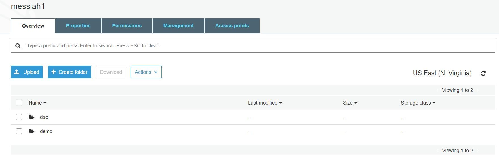
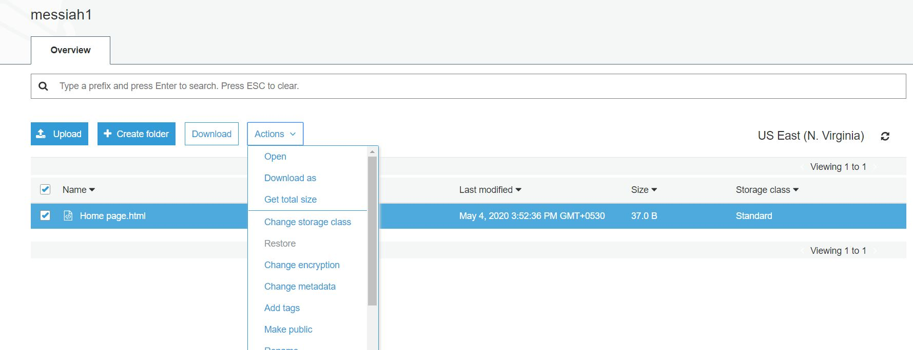
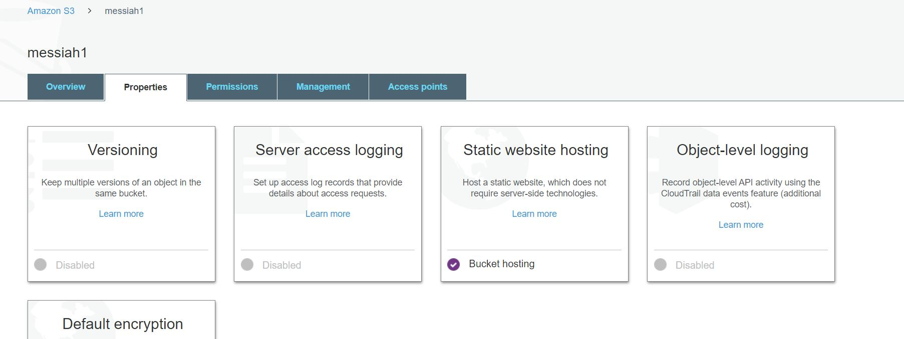

## What is Amazonn S3?
   Amazon S3 is a service in AWS that you can use to store and retrieve any amount of data,at any time, from anywhere on the web.  
   It is designed for large capacity,low cost storage provision across multiple geographical regions.  
   Amazon S3 provides IT companies with **Secure**, **Durable** and **Highly Scalable** object storage.  
   You can store virtually any kind of data, in any format, in S3 and when we talk about capacity, the volume and the number of objects
   that we can store in S3 are unlimited.
   
## How to create bucket in S3 for storage?
   
   1) Search for **S3** in **Services** and then click on **S3**.
   
   2) Step 1: Click on **Creat bucket**
      
      
   
   3) Step 2: In **Bucket name** field give the name for the bucket which should be unique across the region.
   
      
      
   4) Step 3: In **Bucket settings for Block Public Access** check the **Block all public access**
   
      
     
   5) Step 4: Click on **Create Bucket** 
   
   
 ## How to host static websites on S3?
 
   1) First make a simple HTML page on the desktop.
   
   2) Step 1: Create a **folder** inside the **bucket** that you have created.
   
      
      
   3) Step 2: Upload the **.html** page inside the **folder**
   
      
   4) Step 3: Now,select **.html** page, click on the **Actions** and choose **Make public**
              **Make public** will be disabled, so to make it enable go in your **Bucket**
              
       
       
   5) Step 4: In your **Bucket**, click on **Properties** and then **Static website hosting**
              
      
      
   6) Step 5: Click on the button **Use this bucket to host a website**, in that fill the field **Index document**
              with your **.html** page name and then click on **Save** button.
              
      
      
   7) Step 6: Go in the folder where the **.html** page is their,select thet page,click on the **Actions** 
              and choose **Make public**, it will be now enabled.
              Now, you can open the page by selecting it and clicking on **Actions** and then **Open**.
              Your website is now successfully hosted in S3.
 
    
   
   
   
   
   
